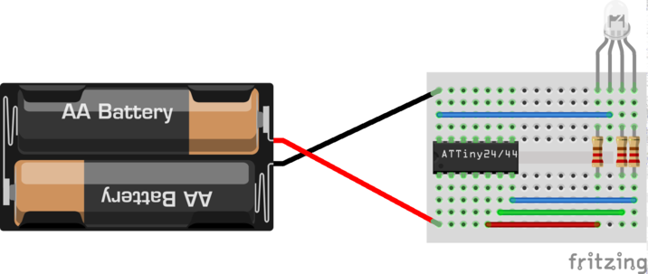
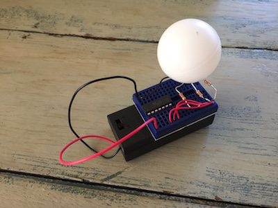

# attiny44-medley
Atmel attiny44-based medley of fun circuits

# Bill of materials

- attiny44A microcontroller
- 1 170 point breadboard
- 2 AA batteries (1.5V)
- Battery holder for 2 AA batteries
- RGB LED [example](http://www.kingbright-europe.de/download/LED-Lamp/L-154A4SURKQBDZGC%28Ver.6%29.pdf)
- 3 220 Ohm resistors
- solid copper wire (eg 0.20 mm2 or 22 AWG) [example](http://www.velleman.co.uk/contents/en-uk/p793.html) 

Optional, for the clap-on switch:

- 1 electret microphone
- 1 LED (any color)
- one extra 220 Ohm resistor

Optional, for the capacitive touch switch:

- 1 1K Ohm resistor
- 1 1M Ohm resistor
- Some fruit ;-)

A wire-stripper with notches for small-gauge wire (22-30 AWG) will be very handy.

# ATtiny44a

# RGB Lamp

[fritzing file](rgb-lamp.fzz)

# Picture

# Programming

