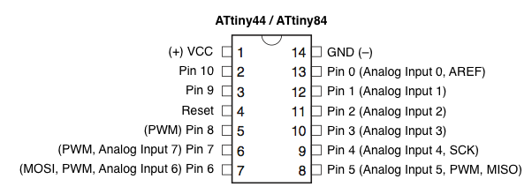
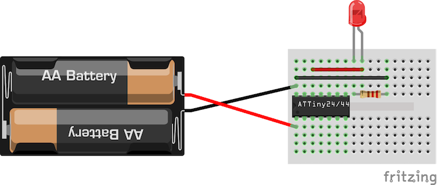
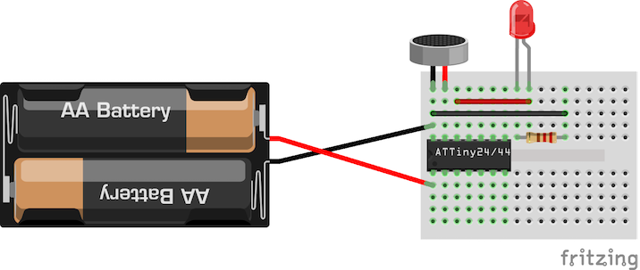

# attiny44-medley
Atmel attiny44-based medley of fun circuits

# Bill of materials

- ATtiny44A microcontroller
- one 170 point breadboard
- two AA batteries (1.5V)
- Battery holder for 2 AA batteries
- RGB LED - [example](http://www.kingbright-europe.de/download/LED-Lamp/L-154A4SURKQBDZGC%28Ver.6%29.pdf)
- three 220 Ohm resistors
- solid copper wire (eg 0.20 mm2 or 22 AWG) - [example](http://www.velleman.co.uk/contents/en-uk/p793.html) 

Optional, for the clap-on switch:

- one electret microphone
- one LED (any color)
- one extra 220 Ohm resistor

Optional, for the capacitive touch switch:

- one 1K Ohm resistor
- one 1M Ohm resistor
- Some fruit ;-)

A wire-stripper with notches for small-gauge wire (20-30 AWG) will be very handy.

# ATtiny44a

The Atmel [ATtiny44a](http://www.atmel.com/devices/ATTINY44A.aspx) is an 8-bit picoPower AVR Microcontroller with 4KB Flash.

See also the [datasheet](http://www.atmel.com/Images/doc8183.pdf)

Here's the ATtiny44 pinout:

# Apple Breathing status LED indicator
Use an LED and some fruit to control a "breathing" LED.

See also [Sean Voisen's blog post](http://sean.voisen.org/blog/2011/10/breathing-led-with-arduino/).

- [fritzing file](fritzing/breathe.fzz)

# RGB Lamp
Use an RGB LED, some resitors and a ping pong ball to build a color-shifting lamp, similar to a [Philips LivingColors](http://www.livingcolors.philips.com) table lamp.

- [fritzing file](fritzing/rgb-lamp.fzz)
- [Arduino code](living-color/living-color.ino)

Use a blank ping pong ball as a diffuser.

Your lamp may look like this:

# Clap-on LED

Use an electret microphone to control an LED by clapping your hands.

- [fritzing file](fritzing/clapon.fzz)
- [Arduino code](clap-on/clap-on.ino)

# Programming

The attiny44a doesn't have a bootloader nor a hardware UART we can use for programming, so we need a programmer and upload our firmware using SPI.

You can use an Arduino or a Raspberry Pi for programming, or some dedicated hardware like an [Arduino ISP](https://www.arduino.cc/en/Main/ArduinoISP).

## Programming using an ArduinoISP

Use the following wiring scheme (refer to the pinout above):

- [fritzing file](fritzing/programming.fzz)

## Programming using an Arduino Uno

To use an Arduino Uno as a programmer, upload the ArduinoISP sketch (from the Arduino *File | Examples* menu) to your Arduino Uno, and wire your Uno to the ATtiny44 as follows:

| Pin | SPI signal |
| --- | --- |
| 10 | RESET |
| 11 | MOSI  |
| 12 | MISO  |
| 13 | SCK   |

Optionally, also connect LEDs with current-limiting resistors on pins 7 (programming), 8 (error), and 9 (heartbeat).

Now, in the *Tools* menu, select Board "ATtiny", Processor "ATtiny44", Clock "1 MHz (internal)", and Programmer "Arduino as ISP" (not to be confused with "ArduinoISP").

Finally, open the sketch intended for the ATtiny44, and select *Upload Using Programmer*.

